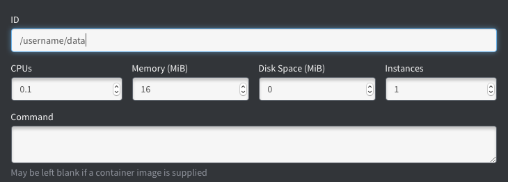
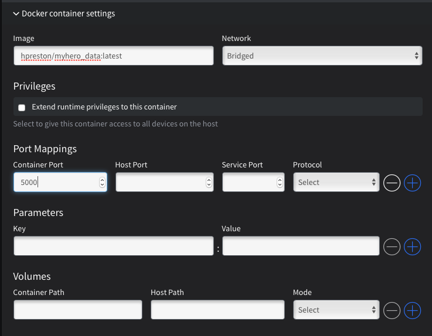
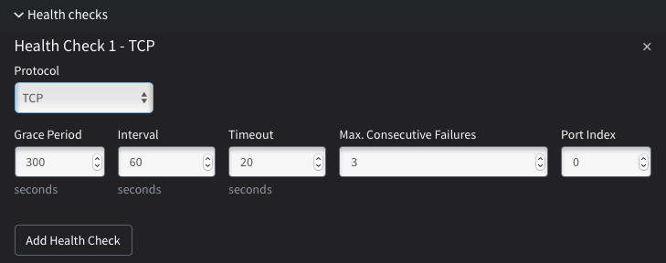
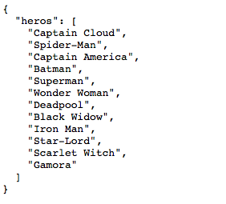
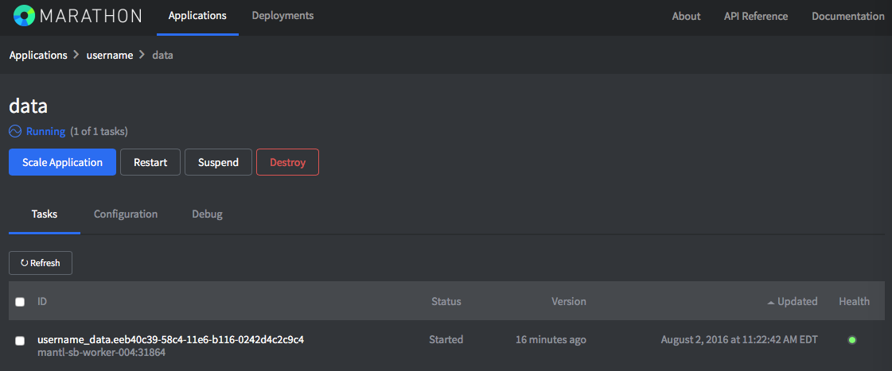
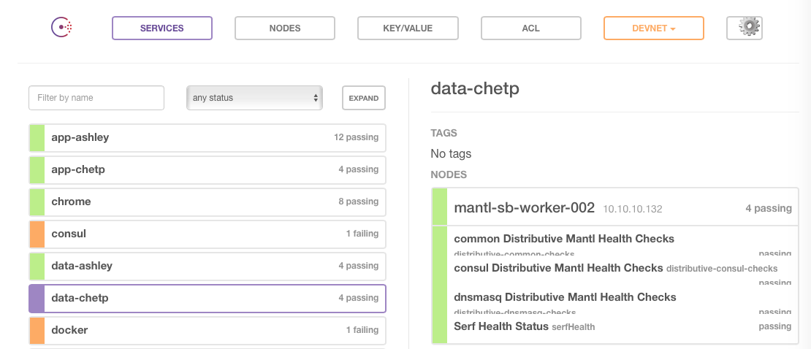
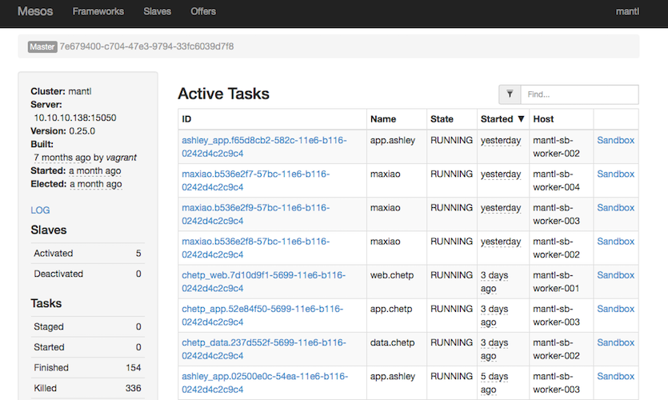

[item]: # (slide)


# Module: Mantl.io

A Batteries-Included OpenSource Micro-Service Architecture Stack

[item]: # (/slide)

[item]: # (slide)

## Agenda

* [Marathon 101](#marathon-101)
* [Consul 101](#consul-101)
* [Mesos 101](#mesos-101)
* [Traefik 101](#traefik-101)
* [Vault 101](#vault-101)


[item]: # (/slide)

[item]: # (slide)

## Mantl Links

* [Mantl.io](http://mantl.io)
* [http://docs.mantl.io](http://docs.mantl.io)
* [https://github.com/CiscoCloud/mantl](https://github.com/CiscoCloud/mantl)
* [https://learninglabs.cisco.com/labs](https://learninglabs.cisco.com/labs) 

[item]: # (/slide)

[item]: # (slide)

# Marathon 101

* GUI 
	* Deploying Applications
	* Lifecycle Actions
* API 


[item]: # (/slide)

Marathon is one of the components of Mantl that can allow developers to deploy microservice applications easily.  Marathon is great for long running workloads based on Docker containers or executables (ie a JAR file).  It uses Mesos (another part of Mantl) to actual schedule the jobs onto an available worker node.  

Marathon provides users with a Web GUI and API for configuring and managing applications.  There is also a set of command line utilities that are part of DCOS (Mesosphere's Data Center Operating System).  

**_The GUIs for different components do change from one version to the next.  The basic functionality shouldn't change, however the look in the UI, or the exact method of navigation might adjust.  Be flexible..._**

[item]: # (slide)

## Experiments

* GUI Walkthrough
* API Examples

[item]: # (/slide)

We will leverage the [Cisco DevNet Mantl Sandbox](https://developer.cisco.com/site/devnet/sandbox/available-labs/cloud/index.gsp) for these experiments.  Access to the sandbox is Always-On and shared.  You'll need to have the username, password, and URL that is posted within the sandbox documents.  

* Open the [Sandbox Mantl Dashboard](https://mantlsandbox.cisco.com/ui/) and login with the credentials listed on DevNet

[item]: # (slide)

    **DevNet Mantl Sandbox**
     

[item]: # (/slide)

### GUI Walkthrough 

Though most actual work with Marathon would be through the API, having an understanding of the GUI is helpful for demo's and useful for some quick status checks and ad-hoc actions.  

* Control Click on the "Web UI" link under Marathon to open a new tab for Marathon.  

[item]: # (slide)

    **Marathon UI**
     

[item]: # (/slide)

* Let's create a new application.  Throughout the walkthrough replace **USERNAME** with your name.  And remember this is a shared environment so be sure you don't interfere with others applicatons.  
	* Click `CREATE`
	* Provide a name for the new application and options to configure hardware details.  

[item]: # (slide)

    **New Application**    
    

[item]: # (/slide)

	* Provide Details on the Docker container.  

[item]: # (slide)

        **Container Details**
        

[item]: # (/slide)

		* Don't forget to indicate the Docker tag
		* Network will typically be "Bridged"
		* The ports listed under port mappings will make the container accessable by other services and external users.  
		* If the container needs to have volumes mapped in, you can do that here as well.  

	* Many times you'll need to configure environment variables for the applications to operate correctly.  

[item]: # (slide)

        **Environment Variables**
		 


[item]: # (/slide)

	* Though not required, it is recommended to include Health Checks for all applications.  

[item]: # (slide)

        **Health Checks**
		 

[item]: # (/slide)

	* Once saved and deployed, your application should be available for use.  The applicaiton we deployed is the [data tier for the MyHero Demo Application](https://github.com/hpreston/myhero_data).  This service delivers an API and can be tested at [http://username-data.app.mantldevnetsandbox.com/hero_list](http://username-data.app.mantldevnetsandbox.com/hero_list)

[item]: # (slide)

        **Deployed Micro-Service**
        
        

[item]: # (/slide)

* Once created, you can manage the application through the GUI as well.  

[item]: # (slide)

    **GUI Management**
	


[item]: # (/slide)

[item]: # (slide)

### API Examples and Walkthrough 

[item]: # (/slide)

Marathon provides a very robust REST API that can be used for all actions within the platform.  When tying to CICD tools, or other Infrastructure as Code concepts, the API will be the main tool used.  

* Prepare a terminal session with some Environment Variables for easier work.  

[item]: # (slide)

    **Environment Variables**
    
    ```
    export MARATHON_URL=https://mantlsandbox.cisco.com:8080/v2
    export MARATHON_USER=admin
    # Fill in Password
    export MARATHON_PASSWORD=********	
    # Use your username from above
    export MYUSERNAME=username
    ```


[item]: # (/slide)

* Get a list of the applications deployed to Marathon 

[item]: # (slide)

    **List Applications**
    
    ```
    curl -k -X GET -u $MARATHON_USER:$MARATHON_PASSWORD \
    	-H "Content-type: application/json" \
    	$MARATHON_URL/apps \
    	| python -m json.tool
    	
    # this will dump out a ton of data for every application that is deployed
    # Let's filter it down to just the one we built 
    	
    curl -k -X GET -u $MARATHON_USER:$MARATHON_PASSWORD \
    	-H "Content-type: application/json" \
    	$MARATHON_URL/apps/$MYUSERNAME/data \
    	| python -m json.tool
    	
    ```
	

[item]: # (/slide)

* Scale our application up

[item]: # (slide)

    **Update Application**	
    
    ```
    curl -k -X PUT -u $MARATHON_USER:$MARATHON_PASSWORD \
    	-H "Content-type: application/json" \
    	$MARATHON_URL/apps/$MYUSERNAME/data \
    	-d '{"instances": 3}' \
    	| python -m json.tool
    	
    ```


[item]: # (/slide)

* Delete our application 

[item]: # (slide)

    **Delete Application**
    
    ```
    curl -k -X DELETE -u $MARATHON_USER:$MARATHON_PASSWORD \
    		-H "Content-type: application/json" \
    		$MARATHON_URL/apps/$MYUSERNAME/data 
    ```


[item]: # (/slide)

[item]: # (slide)

## Links 

* [http://mesosphere.github.io/marathon/](http://mesosphere.github.io/marathon/)
* [https://mesosphere.github.io/marathon/docs/rest-api.html](https://mesosphere.github.io/marathon/docs/rest-api.html)


[item]: # (/slide)

[item]: # (slide)

## Why do we care

[item]: # (/slide)

Building a modern app and microservice is more than just being able to code and create a container that can run on your laptop.  Being able to deploy these applications in a scalable environment is critical.  Solutions like Marathon/Mesos, Kubernetes, and Docker Swarm are focused on providing the next generation infrastructure stack for applications.  

Marathon is just one of the possible tools in this space, but as a core part of Mantl.io it is a great one to start with.  But you'll also need to understand that it is just one solution your customer might be considering.  

[item]: # (slide)

## Go do it exercises 

Visit [hpreston\myhero_demo](https://github.com/hpreston/myhero_demo) and deploy it to the DevNet Sandbox.  Don't just deploy it though, look at the scripts that are included that you are running to understand what is being used to deploy the applications.  

[item]: # (/slide)

[item]: # (slide)

# Consul 101

* Service Discovery/DNS
* Key/Value Store

[item]: # (/slide)

A big element of any microservices architecture is how service discovery will be addressed.  Service discovery refers to the need for each of the different microservices in an application to be able to find and reference each other automatically.  When you have dozens of services in an applicaiton, that are backed by constantly scaling up and down container workloads, where the IPs, Ports, Hosts, etc are constantly changing, you can't rely on old methods of hard coding in IPs or server names.  

Consul is an open source application that provides Service Discovery for microservice platforms.  Through plugins and integration, it tracks platforms like Marathon to automatically register new services.  

Consul also provides a scalable key/value store that can be used by applications and services to store and access data.  

In practice, Service Discovery is done through DNS resolution.  However, because of the need to link not only the IP address, but also the PORT for an application, often you'll use SRV lookups along with A record lookups to find the full identify of a service.  

[item]: # (slide)

## Experiments

[item]: # (/slide)

We will leverage the [Cisco DevNet Mantl Sandbox](https://developer.cisco.com/site/devnet/sandbox/available-labs/cloud/index.gsp) for these experiments.  Access to the sandbox is Always-On and shared.  You'll need to have the username, password, and URL that is posted within the sandbox documents.  

* Open the [Sandbox Mantl Dashboard](https://mantlsandbox.cisco.com/ui/) and login with the credentials listed on DevNet

[item]: # (slide)

    **DevNet Mantl Sandbox**
	 

[item]: # (/slide)

[item]: # (slide)

    **Consul UI**
    

[item]: # (/slide)

* Select one of the services listed
	* You can see the details that Consul knows about the service in the Web UI.  This includes the worker node the service is running on, and any health checks being monitored.  
* To find out the full details about the service, that is the the host, ip and port needed to access the application.  You would need to leverage the API or perform a DNS lookup.  
	* For security purposes, consul lookups via the API or DNS are often secured from external users.  Only trusted internal services should have a need to access the Consul data.  
	* **_If you have access to a Mantl Cluster you can execute these exercises as well.  Otherwise they will be demonstrated._**

* We will leverage dig to discover full details on a service.    
	* The default format for Marathon Apps in Consul is: `app-folder.service.consul` 
	* Within Mantl, the control nodes provide the DNS Server for Consul queries

[item]: # (slide)

    **Consul DNS Lookup**
    
    ```
    # this shows an example command and output for reference.  
    	
    # do a regular lookup
    dig @control.mantl.domain.intra app-dev.service.consul
    	
    ; <<>> DiG 9.8.3-P1 <<>> @control.mantl.domain.intra app-dev.service.consul
    ; (3 servers found)
    ;; global options: +cmd
    ;; Got answer:
    ;; ->>HEADER<<- opcode: QUERY, status: NOERROR, id: 42128
    ;; flags: qr aa rd ra; QUERY: 1, ANSWER: 1, AUTHORITY: 0, ADDITIONAL: 0
    	
    ;; QUESTION SECTION:
    ;app-dev.service.consul.		IN	A
    	
    ;; ANSWER SECTION:
    app-dev.service.consul.	0	IN	A	10.101.129.119
    	
    ;; Query time: 187 msec
    ;; SERVER: 10.101.129.123#53(10.101.129.123)
    ;; WHEN: Tue Aug  2 16:13:21 2016
    ;; MSG SIZE  rcvd: 78	
    	
    # We get an A record back so we know the IP 
    # of the host running the app, but not the port
    	
    # Same lookup, but this time for the SRV record
    dig @control.mantl.domain.intra app-dev.service.consul SRV
    	
    ; <<>> DiG 9.8.3-P1 <<>> @control.mantl.domain.intra app-dev.service.consul SRV
    ; (3 servers found)
    ;; global options: +cmd
    ;; Got answer:
    ;; ->>HEADER<<- opcode: QUERY, status: NOERROR, id: 59685
    ;; flags: qr aa rd ra; QUERY: 1, ANSWER: 1, AUTHORITY: 0, ADDITIONAL: 1
    	
    ;; QUESTION SECTION:
    ;app-dev.service.consul.		IN	SRV
    	
    ;; ANSWER SECTION:
    app-dev.service.consul.	0	IN	SRV	1 1 25797 green2-worker-001.node.green.consul.
    	
    ;; ADDITIONAL SECTION:
    green2-worker-001.node.green.consul. 0 IN A	10.101.129.119
    	
    ;; Query time: 140 msec
    ;; SERVER: 10.101.129.123#53(10.101.129.123)
    ;; WHEN: Tue Aug  2 16:13:23 2016
    ;; MSG SIZE  rcvd: 168
    	
    	
    # Now we have the IP and the Port so can access this service	
    ```

[item]: # (/slide)

[item]: # (slide)

## Links 

* [https://www.consul.io](https://www.consul.io)
* [https://technologyconversations.com/2015/09/08/service-discovery-zookeeper-vs-etcd-vs-consul/](https://technologyconversations.com/2015/09/08/service-discovery-zookeeper-vs-etcd-vs-consul/)

[item]: # (/slide)

[item]: # (slide)

## Why do we care

[item]: # (/slide)

For most basic, single service applications, Service Discovery is something that can be ignored.  However any actual application will have multiple services, and having a method of addressing discovery is critical to an cloud native solution.  Even if our demo's don't require it, it is importnat to understand the problem it is solving, and how it works.  

[item]: # (slide)

## Go do it exercises 

The MyHero Demo application leverages service discovery with Consul for the APP to find and access the DATA tier.  Take a look at the configuraiton in Marathon after deploying to see how it is passed in.  _Hint: look at the environment variables_.  Then take a look at the actual code for [myhero_app](https://github.com/hpreston/myhero_app) and see if you can find the parts of the code where the DNS lookup is happening.  

[item]: # (/slide)

[item]: # (slide)

# Mesos 101

[item]: # (/slide)

Mesos is the actual scheduler used by Marathon to provision workloads onto hosts.  Mesos can be useful when needing to diagnosis a problem with an application that isn't behaving as expected.  Each application runs in a "sandbox'd" area with Mesos where all std_out and std_err logs are captured and made available.  

[item]: # (slide)

## Experiments

[item]: # (/slide)

We will leverage the [Cisco DevNet Mantl Sandbox](https://developer.cisco.com/site/devnet/sandbox/available-labs/cloud/index.gsp) for these experiments.  Access to the sandbox is Always-On and shared.  You'll need to have the username, password, and URL that is posted within the sandbox documents.  

* Open the [Sandbox Mantl Dashboard](https://mantlsandbox.cisco.com/ui/) and login with the credentials listed on DevNet

[item]: # (slide)

    **DevNet Mantl Sandbox**
	 

[item]: # (/slide)

* Control Click on the "Web UI" link under Mesos to open a new tab for Mesos.  

[item]: # (slide)

    **Mesos Dashboard**
	 

[item]: # (/slide)

	* You'll see a list of all active tasks as well as statistics.  
	* An interesting thing to note is on the bottom of the left pane.  Itshows the total capaciaty from CPU and RAM in the cluster.  If idle gets too low, new tasks won't start.  

* Click the **Sandbox** link on one of the tasks 

[item]: # (slide)

    **Application Sandbox**
	 

[item]: # (/slide)

[item]: # (slide)

## Links 

* [https://medium.com/@ArmandGrillet/comparison-of-container-schedulers-c427f4f7421#.6l6wryf0o](https://medium.com/@ArmandGrillet/comparison-of-container-schedulers-c427f4f7421#.6l6wryf0o)
* [https://www.digitalocean.com/community/tutorials/the-docker-ecosystem-scheduling-and-orchestration](https://www.digitalocean.com/community/tutorials/the-docker-ecosystem-scheduling-and-orchestration)
* [http://mesos.apache.org](http://mesos.apache.org)
* [http://mesos.apache.org/documentation/latest/](http://mesos.apache.org/documentation/latest/)
* [http://mesos.apache.org/documentation/latest/sandbox/](http://mesos.apache.org/documentation/latest/sandbox/)

[item]: # (/slide)

[item]: # (slide)

## Why do we care

[item]: # (/slide)

The scheduler function of a Cloud Native Stack is a criticial component to scaling and maintaining a reliable platform for produciton deployments.  Running a docker container on a laptop is vastly different from managing them across an entire data center.  As we have discussions with developers, and help build platforms for the next generation data center, this knowledge will be critical.  

It is also important to understand the players in this space, and how they stack up amongst each other.  

[item]: # (slide)

## Go do it exercises 

Explore the Mesos interface and see if you can find answers to these questions... 

* How many individual hosts are available in the sandbox, what are their stats 
* What frameworks are installed in the Sandbox 
	* Do a bit of research into what a "framework" is with Mesos

[item]: # (/slide)

[item]: # (slide)

# Traefik 101

* Troubleshooting 101
* Checking Status
* Traefik Labels for Marathon

[item]: # (/slide)

Traefik provides the load balancing and reverse proxy for Mantl applications.  In the Mantl architecture the "edge" nodes are the ingress/egress points for all traffic with the cluster.  

Traefik monitors applicaitons deployed in the cluster, creates new frontend and backend connections, as well as auto-scales them in line with the actions taken in Marathon (as an example).  

At installation, the Traefik is configured with a DNS domain that is used as the base for all applications.  This DNS Domain should be configured with a wildcard entry pointing at the public IPs of the edge servers.  This enables every application to automatically be active and available.  

The configuraiton of the traefik behavior can be accomplished with labels in Marathon.  You can disable traefik for services where you do NOT want to advertise them outside the cluster.  And you can pass the host header through traefik to the destination service.  These are important to understand as you deploy applications to Mantl.  

[item]: # (slide)

## Experiments

[item]: # (/slide)

* Open the [Sandbox Mantl Dashboard](https://mantlsandbox.cisco.com/ui/) and login with the credentials listed on DevNet

[item]: # (slide)

    **DevNet Mantl Sandbox**
	 

[item]: # (/slide)

[item]: # (slide)

* Use the skills from above to deploy a new application to Marathon with these details
	* Marathon ID: ***YOURNAME***/demo
	* Docker Details
		* hpreston/cicd_demoapp:latest
		* port 5000
	* TCP Health Check 


[item]: # (/slide)

* Control Click on the "Web UI" link under Traefik to open a new tab for Traefik.  Scroll through the list and locate your application front-end

[item]: # (slide)

    **Traefik UI**
    

[item]: # (/slide)

* Copy the Address listed for host and navigate to the endpoint `/hello/world`.  You should see this page in reply.  	

[item]: # (slide)

    **Running Application**
    

[item]: # (/slide)

[item]: # (slide)

## Links 

* [https://docs.traefik.io](https://docs.traefik.io)
* [https://docs.traefik.io/toml/#marathon-backend](https://docs.traefik.io/toml/#marathon-backend)

[item]: # (/slide)

[item]: # (slide)

## Why do we care

[item]: # (/slide)

With microservices, the number and lifespan for a service varies greatly and changes on a dime.  Every cloud native architecture requires a method to seamlessly provide access to these applications, and loadbalanceers/reverse proxies play a huge role.  Traditional platforms in this space weren't designed for these workloads, so solutions like Traefik, nginx, and HA Proxy are often used in place of traditional load balancing appliances.  It is important to understand their place in an application architecture, and what unique challenges this environment poses to them.  

[item]: # (slide)

## Go do it exercises 

Review the available labels for Traefik and Marathon integraiton (link above) and see if you can update the demo application such that
it is available at a different hostname/URL.

[item]: # (/slide)

